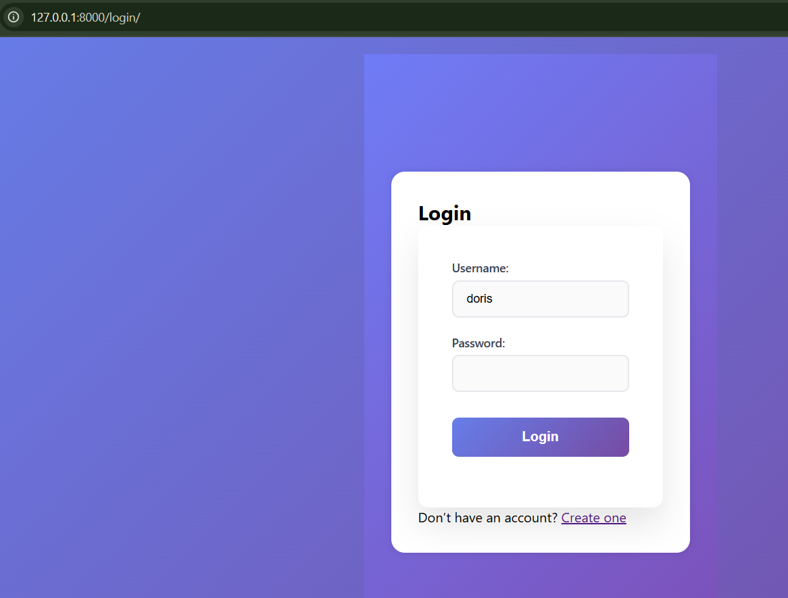

# 🧑‍💻 Django User Functionality Project

This Django project implements user registration, verification, login, profile management, password change, and logout functionalities — all styled with custom templates.

---

## � Screenshots

Here is a preview of the user registration page:



## �🚀 Features

* User Registration with email verification code
* Secure Login & Logout
* Profile View & Edit
* Change Password (inside UI, not admin panel)
* Basic form validations & styling
* Admin dashboard access for superusers

---

## 🛠️ Installation & Running Instructions

Follow these steps to get the project up and running locally:

### 1. Clone the repository

```bash
git clone https://github.com/your-username/django-user-functionality.git
cd django-user-functionality
```

### 2. Create and activate a virtual environment

```bash
python -m venv venv
```

Activate it:

* **On Windows:**

  ```bash
  venv\Scripts\activate
  ```
* **On macOS/Linux:**

  ```bash
  source venv/bin/activate
  ```

### 3. Install dependencies

```bash
pip install -r requirements.txt
```

### 4. Run migrations

```bash
python manage.py migrate
```

### 5. Start the development server

```bash
python manage.py runserver
```

Then visit:
[http://127.0.0.1:8000/](http://127.0.0.1:8000/)

---

## 👤 Superuser (Admin Access)

To access the Django admin panel, create a superuser:

```bash
python manage.py createsuperuser
```

Then go to [http://127.0.0.1:8000/admin/](http://127.0.0.1:8000/admin/)

---

## 📂 Project Structure

```
django-user-functionality/
├── accounts/
│   ├── templates/
│   │   ├── accounts/
│   │   │   ├── register.html
│   │   │   ├── login.html
│   │   │   ├── profile.html
│   │   │   ├── edit_profile.html
│   │   │   └── change_password.html
│   └── views.py
├── user_functionality/
│   ├── settings.py
│   └── urls.py
├── static/
│   └── css/
│       └── styles.css
├── requirements.txt
└── manage.py
```

---
## 🖼️ Screenshots

Below are a few key UI screens from the application:

### 📝 Registration Page
User enters credentials to sign up and gets a verification code.


---

### 🔐 Verification Page
User verifies their account using the generated 6-digit code.


---

### 🔓 Login Page
Only verified users can log in. Others are redirected with a warning.


---

### 👤 Profile Page
Displays user info; only accessible when logged in.


---

### 🛠️ Edit Profile Page
Allows users to update their username or email.


---

### 🔒 Change Password Page
Lets users change their password securely without admin access.


---

### 🧑‍💼 Admin Panel
Accessible by superusers to manage accounts.


