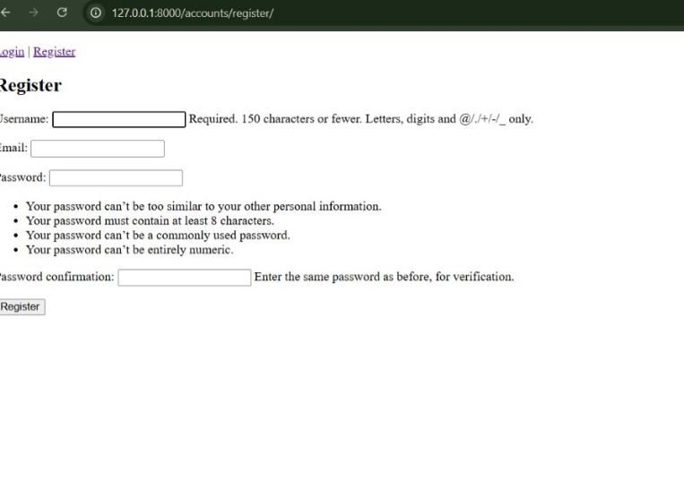
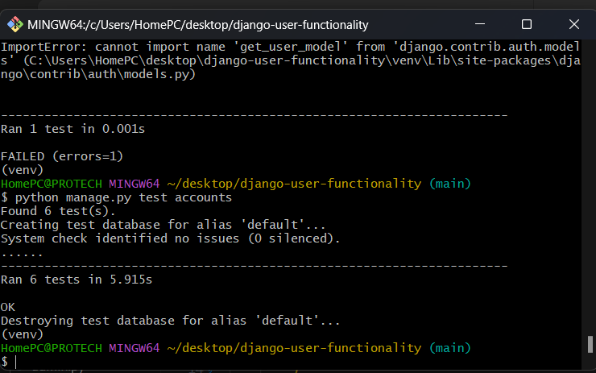

# Django User Functionality App

This is a Django web application that handles user registration, verification, login, logout, profile access, and admin management — built using a custom user model. The app covers everything from database models to form handling, access control, and unit testing.

---

## 💡 What the Project Does

This project simulates a real-world authentication system with these core features:

- Custom user model using Django’s `AbstractUser`
- User registration with verification code generation
- A verification view for confirming accounts
- Secure login/logout
- Protected profile page (only accessible after login)
- Admin panel to manage users
- Django forms for clean user input
- Unit tests for both views and models

---

## 📦 Features Breakdown


### 1. Registration

Users sign up with a form that collects username, email, and password. A 6-digit `verification_code` is generated and stored.

> ✅ After registering, the user is redirected to a **verification page**.

### 2. Verification

The user enters their verification code. If it matches, the `is_verified` field is set to `True` and they can now log in.

### 3. Login

Only verified users can log in. If they try before verifying, they get a prompt.

### 4. Profile View & Edit

- Logged-in users can view their profile.
- An **Edit Profile** page allows users to update their username or email.

### 5. Logout

A standard logout route ends the session and redirects to login.

---

## 🧩 Tech Stack

- **Python 3.11**
- **Django 5.2**
- **SQLite** for development DB
- **Bootstrap** (for basic styling)
- **Git + GitHub** for version control

---

## 📸 Screenshots

Paste your screenshots here using this format (use actual file paths or GitHub URLs after pushing):

### 🔐 Registration Page
s/register.png)

### 🔄 Verification Page
!([Verification Page](image-2.png)/verify.png)

### 🔓 Login Page
/login.png)

### 👤 Profile Page
/profile.png)

### ✏️ Edit Profile Page
/edit-profile.png)

### ⚙️ Admin Panel
!([Admin Panel](image-6.png)/admin.png)

> Tip: Save screenshots in a `screenshots/` folder at your project root, or upload them via GitHub and copy their URLs.


1. **Custom User Model**

Located in `accounts/models.py`, the model extends Django’s built-in `AbstractUser`:

```python
class CustomUser(AbstractUser):
    is_verified = models.BooleanField(default=False)
    verification_code = models.CharField(max_length=6, blank=True, null=True)
his lets you store whether a user is verified and assign them a 6-digit code during registration.

✅ 2. Forms
In accounts/forms.py, the app uses custom Django forms for user input:

RegisterForm: handles signup and verification code generation

LoginForm: validates credentials

VerificationForm: checks a user's code

Each form is tied to logic in the views to keep things modular and readable.

✅ 3. Views
Views in accounts/views.py handle logic like:

register: creates a user and assigns a code

verify: compares user-entered code with database

login_view: authenticates the user

logout_view: ends the session

profile: only viewable by logged-in users

✅ 4. URLs
In accounts/urls.py, each view is mapped with a named route:

"""
path('register/', register, name='register')
path('verify/', verify, name='verify')
path('login/', login_view, name='login')
path('logout/', logout_view, name='logout')
path('profile/', profile, name='profile')
Then included in the main django_project/urls.py."""

✅ 5. Templates
Located in accounts/templates/, each view has its own HTML file:

register.html

login.html

verify.html

profile.html

Templates use Django’s template language and extend a base file if included.

✅ 6. Settings Configuration
In settings.py, you added:

AUTH_USER_MODEL = 'accounts.CustomUser'

This line tells Django to use your custom user model throughout the project.

Also, 'accounts' is included in INSTALLED_APPS.

🧪 Testing
I wrote unit tests in accounts/tests.py to verify:

Model fields (is_verified, password hashing, etc.)

View access (login, register, protected routes)

Authentication and redirection logic

Example test:

"""
def test_profile_requires_login(self):
    response = self.client.get(reverse('profile'))
    self.assertRedirects(response, '/login/?next=/profile/')"""
🔧 How to Run the Project
Clone the repo
"""
git clone https://github.com/your-username/django-user-functionality.git
cd django-user-functionality"""

Create virtual environment
"""
python -m venv venv
venv\Scripts\activate"""
Install dependencies
"""""
pip install django"""

Run migrations
""""
python manage.py migrate"""

Create superuser
"""
python manage.py createsuperuser"""


Run the server
"""
python manage.py runserver
Visit http://127.0.0.1:8000/"""

🧪 Run the Tests
"""
python manage.py test accounts"""

Hands-on with Git, Django, and project deployment

Final Word
This wasn’t just a template project. I built everything from scratch — the model, forms, views, and templates — and wired them up through custom logic, URL routing, and admin configuration. I also wrote real tests to confirm functionality.

It's a full authentication system 


